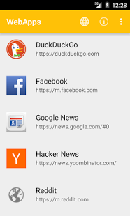
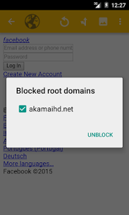

WebApps Sandboxed browser Android app
=====================================

  

This Android app is a fork of the [GoogleApps Sandboxed browser][gapps]. The idea behind it is to provide a secure way to browse popular webapps by eliminating referrers, 3rd party requests, insecure HTTP requests, etc.

It accomplishes this by providing a sandbox for multiple webapps (like Google's apps, Facebook, Twitter, etc.). Each webapp will run in it's own sandbox, with 3rd party requests (images, scripts, iframes, etc.) blocked, and all external links opening in an external default web browser (which should have cookies, plug-ins, flash, etc. disabled). Homescreen (launcher) shortcuts can be created to any of the saved webapps.

By default, all HTTP requests are blocked (only HTTPS allowed). This improves security, especially on untrusted networks. The app can also handle 
HTTPS links and open them in their own sandbox.

For using Google's suite of apps, try the [GApps Sandboxed Browser app][gapps], which works the same as this app but contains specific handling for Google's web apps.

[](https://play.google.com/store/apps/details?id=com.tobykurien.webapps) [](https://f-droid.org/repository/browse/?fdfilter=webapps&fdid=com.tobykurien.webapps) 

Features
========

- Works like Mozilla Prism on the desktop. This is a mostly chrome-less browser that gets out of your way.
- Completely full-screen browsing (auto-hiding actionbar)
- Securely browse mobile sites (uses HTTPS)
- Blocks 3rd party requests (images/scripts/iframes) like the NoScript and NotScripts plugins on the desktop
- Blocks requests to non-HTTPS URLs to maintain security (avoid wire-tapping)
- Allows self-signed SSL certificates to be temporarily accepted
- User agent setting allows more rich mobile experience (depending on site)
- External links open in your default browser
- Long-press links to choose how to open them
- Create shortcuts to your webapps on the homescreen
- Uses much less bandwidth than native apps (like Google+ app). No background sync'ing.
- Features local data storage and caching for reduced bandwidth usage and better speed.
- Fully open source software.


Cookies
=======

Currently, as per [this issue](https://github.com/tobykurien/WebApps/issues/3), cookies are passed between sandboxes, because WebView uses a single cookie store for the app, and does not provide a way to specify different cookie storage locations within the app.

Referer
=======

Referer information is not send on any request (as per default behaviour of Webview), which may lead to problems on some sites, but improves privacy.

Storage
=======

Plugins, and local file access are disabled, however DOM storage and app caching is allowed.

Location
========

The WebView's location access has been disabled, to prevent sites requesting your location.

Libraries
=========

This project makes use of the following libraries/tools:

- Xtend compiler: http://xtend-lang.org
- Xtendroid library: http://github.com/tobykurien/xtendroid

Development
===========

In order to develop in Eclipse:

- Clone the git repository to your local machine (```git clone ...```)
- Inside the checked-out folder, run: ```gradle generateEclipseDependencies```. This will download all the required 3rd party libraries and create Eclipse projects for them (if they are AAR dependencies).
- Open Eclipse and import all projects *and sub-projects* within the checked-out folder
- The project should now compile in Eclipse

The app can be built either using Eclipse or using ```gradle assembleDebug```.

   [gapps]: https://github.com/tobykurien/GoogleNews
	